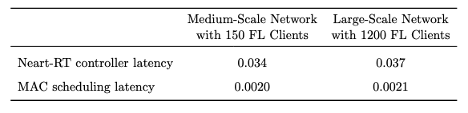

# Elastic Federated Learning over Open Radio Access Network (O-RAN)  

This repository contains the source code for our paper:  
*Elastic Federated Learning over Open Radio Access Network (O-RAN) for Concurrent Execution of Multiple Distributed Learning Tasks*  
[https://arxiv.org/abs/2305.02109](https://arxiv.org/abs/2305.02109)

---

## 📖 Introduction  
We present **Elastic Federated Learning (EFL)** for O-RAN environments, enabling concurrent execution of multiple distributed learning tasks. Our framework integrates O-RAN’s RIC (RAN Intelligent Controller) architecture with federated learning mechanisms to optimize:  
- Multi-FL service resource allocation  
- Latency-aware scheduling  
- Dynamic adaptation to heterogeneous clients  

This implementation is intended for research and reproducibility of our results.  

---

## ⚙️ Installation  

### Requirements  
- Python 3.8+  
- PyTorch (>= 1.10)
- 

## Large-scale Simulation with 1200 Users

In the main paper, we evaluated our framework over medium-scale network using real taxi trajectory data from Porto city, which provides a realistic mobility pattern resembling the dynamics of vehicular clients in urban cellular networks. Here, we evaluate the computation time of our framework in a large-scale network setting with 55 O-DUs, 250 O-RUs, and 1200 FL clients (see the following figure). The colored dots in the figure represent the locations of individual clients, where different colors indicate clients managed by the same O-DU. The coverage areas of the O-RUs, each spanning 500 meters, are depicted as hexagonal cells. In addition, the trajectories of the clients are shown by lines across the city. This setup creates a realistic large-scale vehicular environment for evaluating slice management, mobility handling, and MAC scheduling within the proposed EFL framework.

Our results, presented in the following table, show that the computation time remains tractable even at this scale. Specifically, as shown in Table below, the near-RT slice and mobility management requires on average only 0.03 s per O-DU, while MAC scheduling requires about 0.002 s per O-RU. These results are nearly identical for both the medium-scale network with 150 clients (which is the main setup used for our simulations throughout the paper) and the large-scale network with 1200 clients.



## 📝 Citation  
If you use this code, please cite our paper:  

```bibtex
@article{abdisarabshali2023efl,
  title   = {Elastic Federated Learning over Open Radio Access Network (O-RAN) for Concurrent Execution of Multiple Distributed Learning Tasks},
  author  = {Payam Abdisarabshali and [co-authors]},
  journal = {arXiv preprint arXiv:2305.02109},
  year    = {2023}
}
```

---

## 📜 License  
This project is licensed under the MIT License. See the [LICENSE](LICENSE) file for details.  
